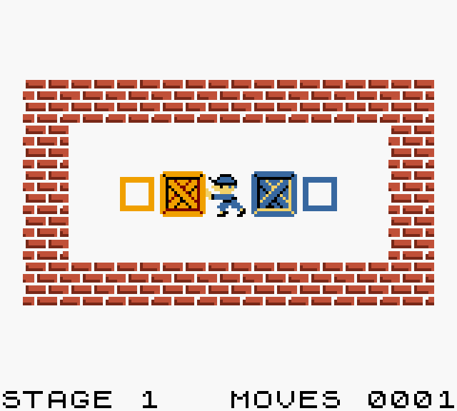

# Objetos

Los objetos son lo que el jugador empuja por el nivel. Este bloque es opcional, ya que se puede hacer un juego que no necesite objetos para completarse, como se explica en [Condiciones de victoria](win.md). Se declara con la palabra clave `OBJECTS`.

Para declarar un objeto escribe el nombre que le quieres dar, seguido de la palabra clave `USES` y de la textura que quieres que utilice. Opcionalmente, puedes añadir la palabra clave `ON_GOAL` seguida de la textura que quieres que use cuando se encuentra sobre su objetivo, para que se vea de un vistazo qué objetos ya están colocados.

```gbsoko
========
OBJECTS
========

crate      USES crate_art      ON_GOAL crate_on_goal_art
blue_crate USES blue_crate_art ON_GOAL blue_crate_on_goal_art
```

Puedes tener varios objetos, cada uno con su casilla objetivo correspondiente, y utilizarlo como condición de victoria. Por ejemplo, que todas las cajas naranjas tengan que ir a la casilla objetivo naranja y todas las azules a la azul.


