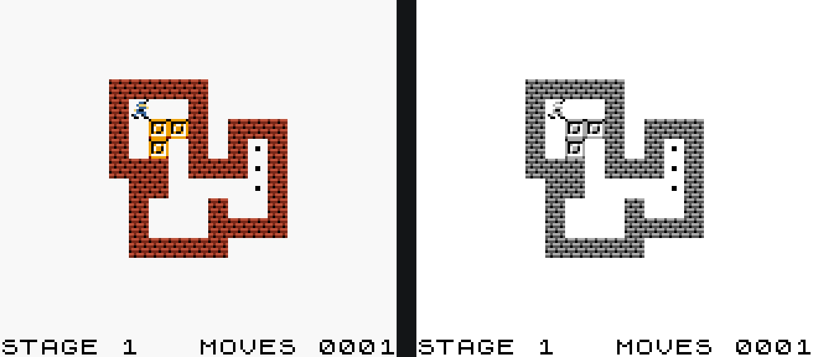
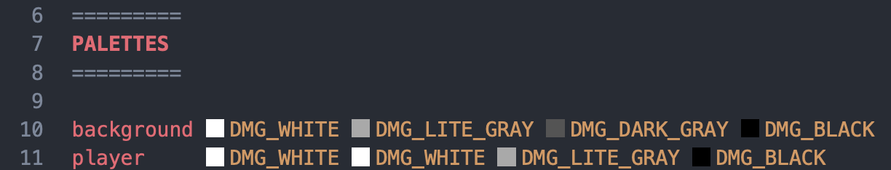
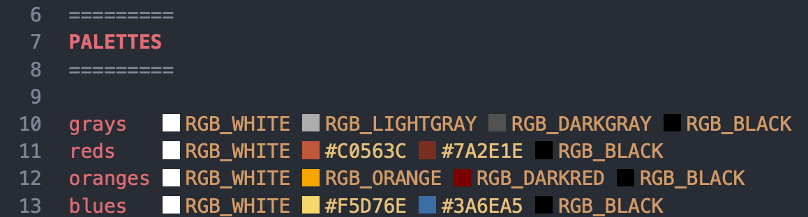

# Paletas

Después de todos los ajustes del inicio del código comienza el bloque de paletas. Es un bloque obligatorio, ya que se necesita al menos una paleta para poder pintar las texturas del juego. Se declara con la palabra clave `PALETTES` y, a continuación, se define cada paleta con el nombre con el que te referirás a ella, seguido de los cuatro colores que la componen.

```gbsoko
=========
PALETTES
=========

background DMG_WHITE DMG_LITE_GRAY DMG_DARK_GRAY DMG_BLACK
player     DMG_WHITE DMG_WHITE DMG_LITE_GRAY DMG_BLACK
```

Puedes generar el juego para la Game Boy original, usando solo los colores DMG, o para la Game Boy Color, usando los colores RGB.



## Game Boy original

Con los colores DMG se genera una ROM `.gb`. Son los cuatro tonos de gris de la consola.

<table>
<tr><td><span class="swatch" style="background:#ffffff"></span> <code>DMG_WHITE</code></td><td><span class="swatch" style="background:#a9a9a9"></span> <code>DMG_LITE_GRAY</code></td><td><span class="swatch" style="background:#545454"></span> <code>DMG_DARK_GRAY</code></td><td><span class="swatch" style="background:#000000"></span> <code>DMG_BLACK</code></td></tr>
</table>

Al generar una ROM `.gb` puedes utilizar hasta tres paletas, una para el fondo y dos para los sprites. A continuación puedes ver un ejemplo de cómo se definirían paletas de grises.



## Game Boy Color

Con los colores que empiezan por `RGB_` se genera una ROM `.gbc`.

<table>
<tr><td><span class="swatch" style="background:#ff0000"></span> <code>RGB_RED</code></td><td><span class="swatch" style="background:#7b0000"></span> <code>RGB_DARKRED</code></td><td><span class="swatch" style="background:#00ff00"></span> <code>RGB_GREEN</code></td><td><span class="swatch" style="background:#007b00"></span> <code>RGB_DARKGREEN</code></td></tr>
<tr><td><span class="swatch" style="background:#0000ff"></span> <code>RGB_BLUE</code></td><td><span class="swatch" style="background:#00007b"></span> <code>RGB_DARKBLUE</code></td><td><span class="swatch" style="background:#ffff00"></span> <code>RGB_YELLOW</code></td><td><span class="swatch" style="background:#adad00"></span> <code>RGB_DARKYELLOW</code></td></tr>
<tr><td><span class="swatch" style="background:#00ffff"></span> <code>RGB_CYAN</code></td><td><span class="swatch" style="background:#e629b5"></span> <code>RGB_AQUA</code></td><td><span class="swatch" style="background:#ff00ff"></span> <code>RGB_PINK</code></td><td><span class="swatch" style="background:#ad00ad"></span> <code>RGB_PURPLE</code></td></tr>
<tr><td><span class="swatch" style="background:#000000"></span> <code>RGB_BLACK</code></td><td><span class="swatch" style="background:#525252"></span> <code>RGB_DARKGRAY</code></td><td><span class="swatch" style="background:#adadad"></span> <code>RGB_LIGHTGRAY</code></td><td><span class="swatch" style="background:#ffffff"></span> <code>RGB_WHITE</code></td></tr>
<tr><td><span class="swatch" style="background:#f7a57b"></span> <code>RGB_LIGHTFLESH</code></td><td><span class="swatch" style="background:#525200"></span> <code>RGB_BROWN</code></td><td><span class="swatch" style="background:#f7a500"></span> <code>RGB_ORANGE</code></td><td><span class="swatch" style="background:#7b7b00"></span> <code>RGB_TEAL</code></td></tr>
</table>

Además de estos colores, también puedes utilizar códigos hexadecimales, como por ejemplo `#C0563C`. Pero ten cuidado, porque la pantalla de la consola no siempre será capaz de reproducir los mismos colores que ves en el navegador. Se pueden utilizar hasta ocho paletas para el fondo y ocho para los sprites. A continuación puedes ver un ejemplo de cómo se definirían paletas de colores.


