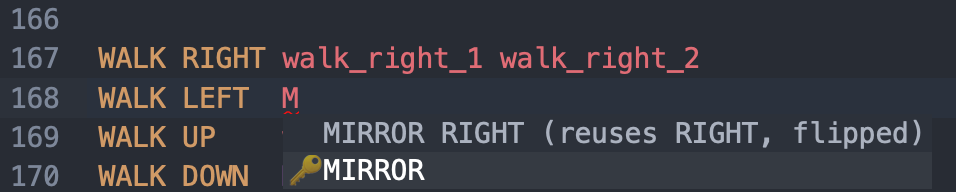
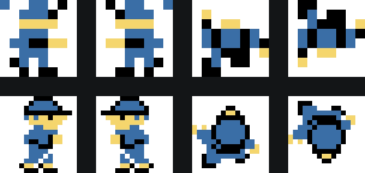
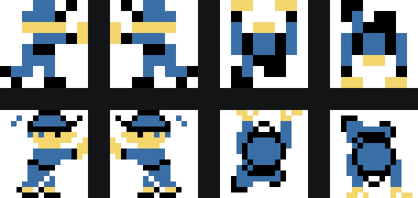

# Jugador

El bloque del jugador es obligatorio, ya que es necesario darle texturas al sprite del jugador. Se declara con la palabra clave `PLAYER`.

Para definir las texturas con las que se mueve el jugador, primero se indica a qué animación se le quieren asignar, que puede ser `WALK`, `PUSH` o `PULL`. A continuación va la dirección, que puede ser `UP`, `DOWN`, `LEFT` o `RIGHT`, seguida de las texturas que quieres que se usen como fotogramas.

```gbsoko
=======
PLAYER
=======

WALK RIGHT walk_right_1 walk_right_2
WALK LEFT  MIRROR RIGHT
WALK UP    walk_up_1 walk_up_2
WALK DOWN  MIRROR UP

PUSH RIGHT push_right_1 push_right_2
PUSH LEFT  MIRROR RIGHT
PUSH UP    push_up_1 push_up_2
PUSH DOWN  MIRROR UP
```

Todas las animaciones deben tener el mismo número de fotogramas, por lo que si para alguna animación tienes menos texturas que para otra, se recomienda repetir la misma textura.

Para optimizar la memoria de vídeo, lo habitual es reutilizar la animación de la dirección contraria dada la vuelta, escribiendo `MIRROR` seguido de esa dirección. Es opcional, pero así no tienes que definir sus texturas de nuevo en el bloque de texturas. `LEFT` y `RIGHT` se dan la vuelta en horizontal, y `UP` y `DOWN`, en vertical.

<div class="box assist-box">
<p class="box-title">Content assist</p>

Pulsa `Ctrl + Espacio` después de la dirección y el editor te sugerirá `MIRROR` con la dirección contraria.



</div>

A continuación se explican los tres tipos de animaciones. En los ejemplos, la fila de arriba es de 8×8 píxeles y la de abajo de 16×16, y de izquierda a derecha van `RIGHT`, `LEFT`, `UP` y `DOWN`.

## WALK

`WALK` es una animación obligatoria. Es la que se utiliza cuando el jugador se está moviendo por el nivel.



## PUSH

`PUSH` es una animación opcional que se utiliza cuando el jugador está empujando un objeto o caminando contra una baldosa con el modificador `BLOCKS`. En caso de no definirla, se reutilizará la animación de caminar.



## PULL

`PULL` es la animación que se utiliza cuando el jugador tira de un objeto, si has habilitado [`PLAYER_CAN_PULL`](prelude.md#player_can_pull) en los ajustes. En caso de no definirla, se reutilizará la animación de caminar.
