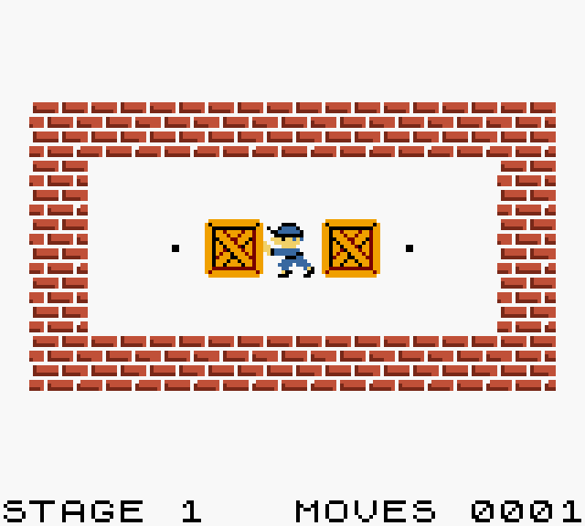
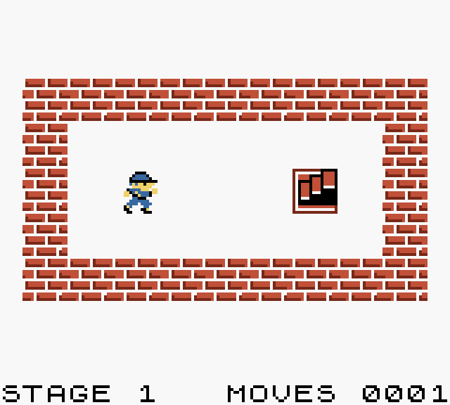
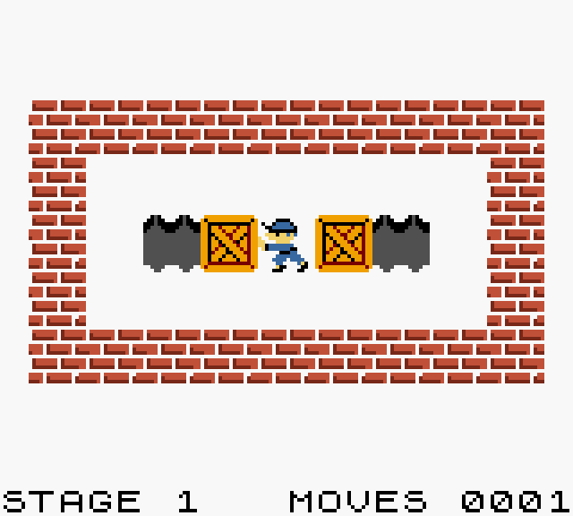

# Condiciones de victoria

El bloque de condiciones de victoria es obligatorio, ya que se necesita una condición de victoria para completar los niveles. Se declara con la palabra clave `WIN`. En caso de tener varias condiciones de victoria, todas se deberán cumplir a la vez.

```gbsoko
====
WIN
====

ALL crate      ON goal
ALL blue_crate ON blue_goal
SOME PLAYER    ON exit
```

En este ejemplo hay que llevar cada caja a la casilla objetivo de su color y que el jugador llegue a la salida.

Hay tres tipos de condiciones de victoria. `ALL` y `SOME` se escriben con el objeto o el jugador, seguido de `ON` y la baldosa sobre la que debe estar, y `NO` con el objeto o la baldosa que no debe quedar en el nivel.

## ALL

Todas las casillas objetivo deben tener encima el objeto indicado. Con esto se pueden hacer niveles con la misma condición de victoria que el Sokoban clásico.

```gbsoko
ALL crate ON goal
```



Cada baldosa objetivo solo puede usarse para un tipo de objeto, como en el ejemplo de [Objetos](objects.md).

## SOME

Funciona igual que `ALL`, salvo que la condición se cumple en cuanto un solo objeto está sobre su casilla objetivo, sin necesidad de cubrirlas todas.

```gbsoko
SOME crate ON goal
```


También se puede usar con el jugador, para que el nivel se complete en cuanto llegue a una casilla, como una salida.

```gbsoko
SOME PLAYER ON exit
```



## NO

`NO` es la más peculiar, ya que se puede utilizar de dos formas, con un objeto o con una baldosa. Con un objeto, se deben eliminar todos los objetos de ese tipo, ya sea con baldosas con el modificador `DESTROYS` o con el modificador `FILLS INTO`.

```gbsoko
NO crate
```


Con una baldosa, la condición es que no quede ninguna de ese tipo. Por ejemplo, que el jugador tenga que caminar por todas las baldosas con `COLLAPSES INTO` hasta que desaparezcan, o rellenar con objetos todas las baldosas con `FILLS INTO`.

```gbsoko
NO hole
```


